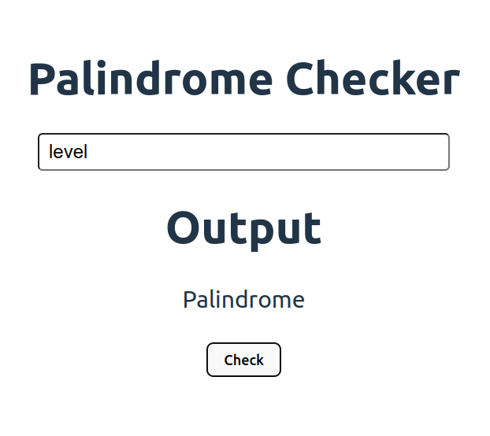
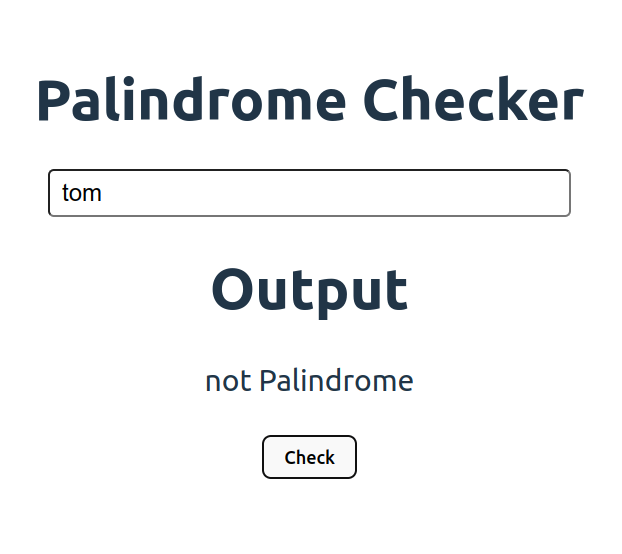

# Palindrome Checker

A palidonrome is a word, number, date or other sequence of symbols that reads the same backwards as forward. This app will help you check wether a word is palindrome or not.

The focus of this project is to write the logic for palindrom and practice javascript.

## MVP

To consider this project complete, the app should have the following:

- The app should correctly identify wether the word is palindrome or not
- Should have basic css styling
- Should have a input field for accepting words
- And a button to check the word

## ScreenShot

